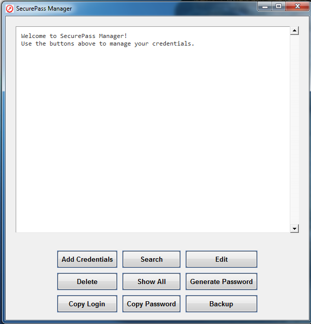

# SecurePass Manager

 <!-- Add a screenshot if available -->

Modern password manager with encryption, saving data locally in encrypted form.

## Functions
- Strong password generation
- Data encryption with master password
- Storage of logins and passwords
- Possibility of editing and deleting entries
- Function of copying logins and passwords to the clipboard
- Backup creation

## System requirements
- Python 3.8+
- Windows/Linux/macOS

## Installation

- clone the repository or download the files:
   ```bash
   git clone https://github.com/pleomati/securepass.git
   cd SecurePass

- Install required dependencies:

   ```bash
   pip install -r requirements.txt

- Run program:

   ```bash
   python securepass.py

Compiling to an executable file
To compile the program into a stand-alone .exe file (Windows):

- Requirements for compilation:
    
    ```bash
    pip install nuitka

- Run command:

    ```bash
    nuitka --onefile --standalone --follow-imports --windows-console-mode=disable --windows-icon-from-ico=icon.ico --include-data-files=C:\Path\to\Icon\icon.ico=icon.ico --enable-plugin=tk-inter --include-package=pandas --enable-plugin=pylint-warnings SecurePass.py

The programme uses an encryption algorithm dependent on the master password

Data is stored locally in the file data.csv

Remember: If you lose your master password, it is not possible to recover the data!

